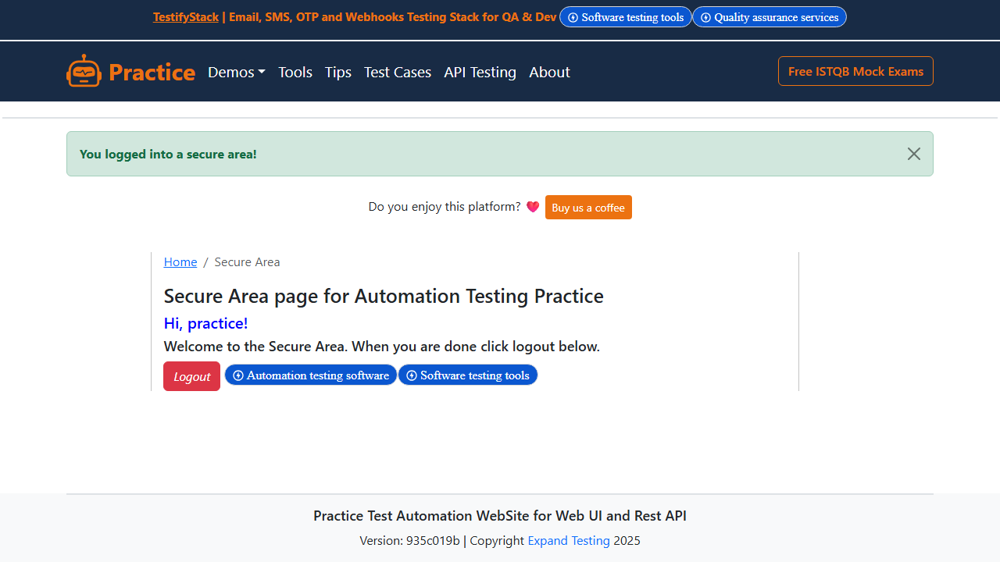

This app helps you easily automate logging into websites. Just enter your login URL, username, and password, and it does the rest—logs in, takes screenshots, and shows you the page content along with detailed logs. It uses Streamlit for a clean interface, Playwright to control the browser, and LangGraph to manage step-by-step automation. It is great for quickly testing login flows without writing any code—just run it and watch everything happen automatically.

